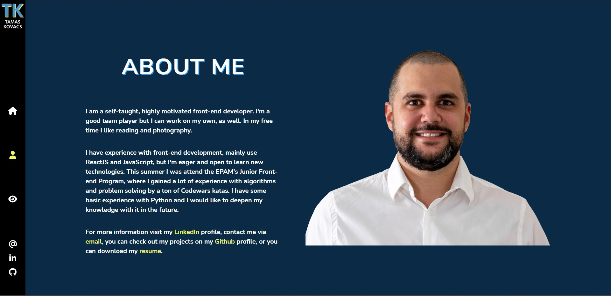

# Portfolio site

Check it on [here](https://tkwebdev.vercel.app/).

## About

This is my portfolio website made with React. You can reach my LinkedIn and GitHub profile, contact me via email or check out my projects. I used React Router 6 to navigate between pages.

## Sources

- [SASS]("https://sass-lang.com/")
- [FontAwesome Icons]("https://www.npmjs.com/package/@fortawesome/react-fontawesome")
- [Free Solid SVG Icons]("https://www.npmjs.com/package/@fortawesome/free-solid-svg-icons")
- [Free Brand SVG Icons]("https://www.npmjs.com/package/@fortawesome/free-brands-svg-icons")
- [Animate.css]("https://animate.style/")
- [React Loaders]("https://www.npmjs.com/package/react-loaders")

## Screenshots

Home page:

About page:

Projects page:

