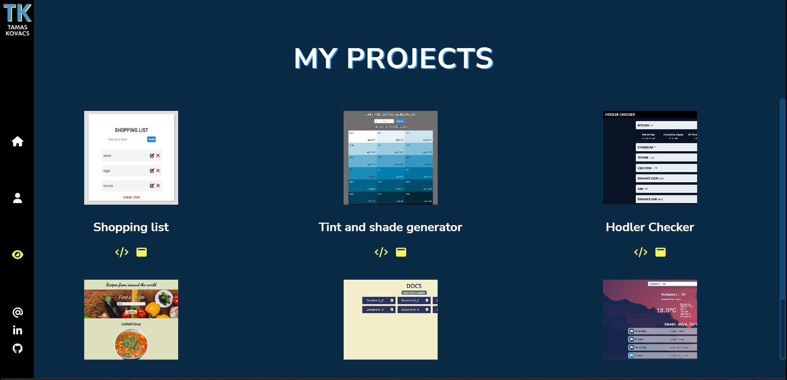

<h1>Portfolio site</h1>

Check it on <a href="https://tkwebdev.eu">here</a>.

**About**

This is my portfolio website made with React. You can reach my LinkedIn and Github profile, contact me via email or check out my projects. I used React Router 6 to navigate between pages.

**Sources**

  - <a href="https://sass-lang.com/">SASS</a>
  - <a href="https://www.npmjs.com/package/@fortawesome/react-fontawesome">Fontawesome Icons</a>
  - <a href="https://www.npmjs.com/package/@fortawesome/free-solid-svg-icons">Free Solid SVG Icons</a>
  - <a href="https://www.npmjs.com/package/@fortawesome/free-brands-svg-icons">Free Brand SVG Icons</a>
  - <a href="https://animate.style/">Animate.css</a>
  - <a href="https://www.npmjs.com/package/react-loaders">React Loaders</a>

**Screenshots**

